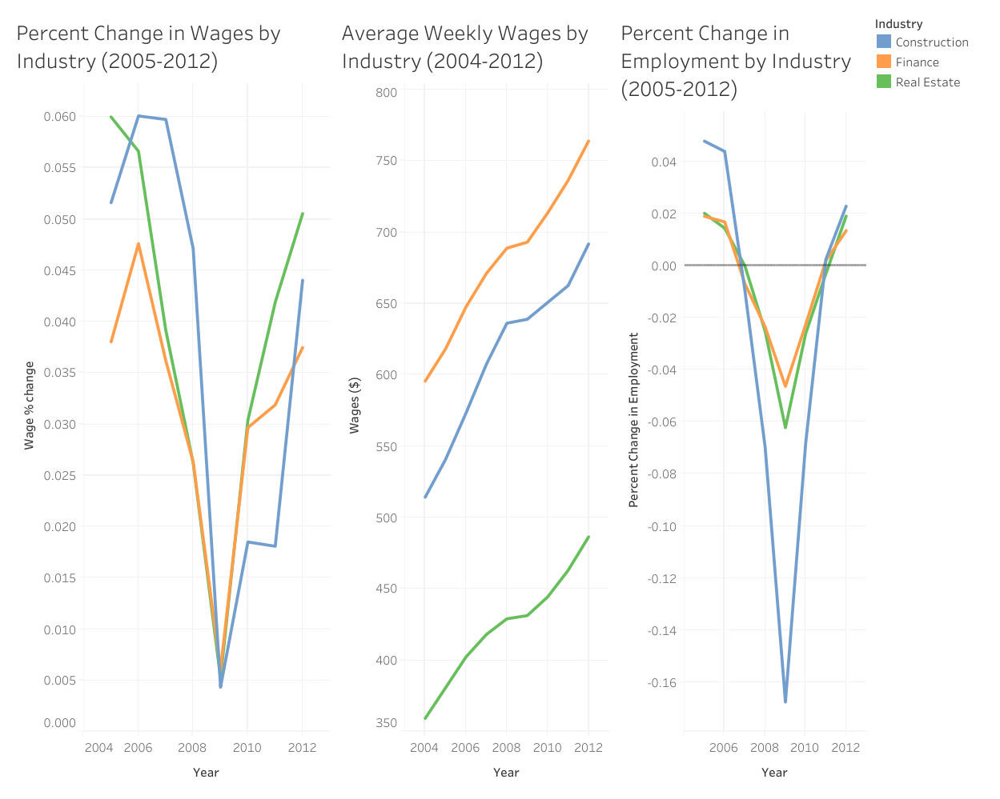

# housing-crisis-wage-employment-analysis

Analysis of employment and average weekly wages in Construction, Finance, and Real Estate industries during the 2008 financial crisis using BLS QCEW data (2004–2012). Includes SQL query, Tableau dashboard, and key insights on industry trends before, during, and after the recession.

## Industry Impact of the 2008 Financial Crisis: Employment and Wages (2004–2012)

This project analyzes the impact of the 2008 housing and financial crisis on employment and wages across three major industries: **Construction**, **Finance**, and **Real Estate**.

Using publicly available data from the **U.S. Bureau of Labor Statistics (BLS) QCEW dataset** in BigQuery, I aggregated quarterly employment and average weekly wage data from **2004 to 2012** into yearly averages. Each year is labeled based on the economic period it represents: **Pre-Crisis**, **Decline**, **Crisis**, or **Recovery**.

## Project Goals

- Track industry-specific employment and wage trends before, during, and after the 2008 financial crisis  
- Visualize and compare percent changes across industries  
- Identify which sectors were most affected and how they recovered  

## Tools Used

- **Google BigQuery** – SQL used to compile and transform quarterly data  
- **Tableau** – Visualizations and dashboard for time-series comparisons  
- **GitHub** – Project documentation and version control  

## Key Metrics

- **Average Weekly Wage**  
- **Third-Month Employment Level** (a proxy for quarterly employment)  

## Files

- `employment_wages_analysis.sql`: Full SQL query used to aggregate and label the dataset ([View SQL query](./employment_wages_analysis.sql))  
- `dashboard.png`: Tableau visualization comparing industry trends over time
- `README.md`: Project overview and methodology  

## Dashboard Preview

*This static image provides a summary of the dashboard layout. Interactive filters (e.g., by crisis period) are available in the Tableau Public version.*  

## Insights

- **Construction** experienced the steepest employment decline during the crisis period  
- **Finance** showed more stability in wages but modest job losses  
- **Real Estate** faced prolonged employment drops with slower wage recovery  

## Data Source

This project uses publicly available data from the **U.S. Bureau of Labor Statistics (BLS) Quarterly Census of Employment and Wages (QCEW)**.

The data was accessed using the **Google BigQuery public dataset**:  
[https://console.cloud.google.com/marketplace/product/bigquery-public-data/bls](https://console.cloud.google.com/marketplace/product/bigquery-public-data/bls)

### BigQuery Tables Used

The following quarterly tables were used to compute yearly averages:

- `bigquery-public-data.bls_qcew.2004_q1` through `2004_q4`  
- `bigquery-public-data.bls_qcew.2005_q1` through `2005_q4`  
- `bigquery-public-data.bls_qcew.2006_q1` through `2006_q4`  
- `bigquery-public-data.bls_qcew.2007_q1` through `2007_q4`  
- `bigquery-public-data.bls_qcew.2008_q1` through `2008_q4`  
- `bigquery-public-data.bls_qcew.2009_q1` through `2009_q4`  
- `bigquery-public-data.bls_qcew.2010_q1` through `2010_q4`  
- `bigquery-public-data.bls_qcew.2011_q1` through `2011_q4`  
- `bigquery-public-data.bls_qcew.2012_q1` through `2012_q4`  

### Industries Analyzed

- **Construction** (NAICS 23)  
- **Financial Activities** (NAICS 1023)  
- **Real Estate and Rental and Leasing** (NAICS 53)  

